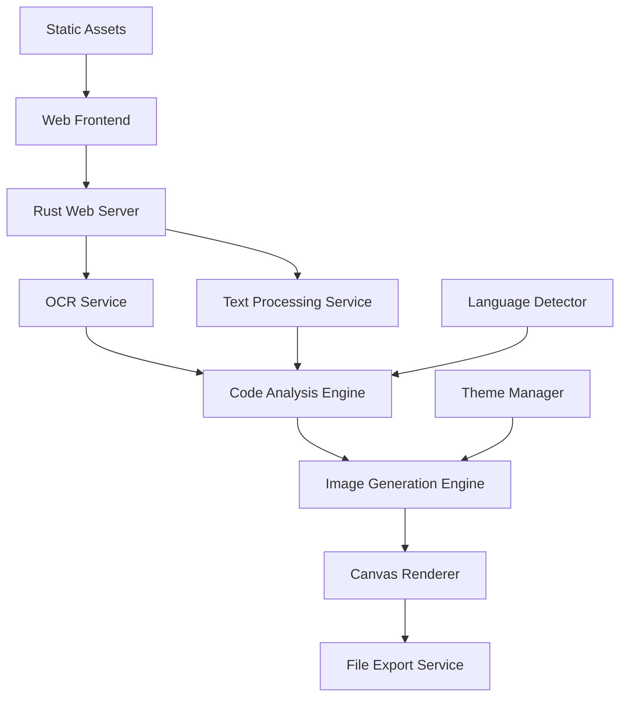

# Design Document

## Overview

The Code Snippet Designer is a web application built with Rust backend and a lightweight frontend that transforms code snippets into visually appealing images. The application processes user input through multiple channels (file upload, text paste, direct typing), applies customizable visual styling, and generates downloadable images suitable for social media sharing and presentations.

## Architecture

### High-Level Architecture



### Technology Stack

- **Backend Framework**: Axum with Tokio async runtime
- **Image Processing**: image-rs and resvg for high-quality rendering
- **OCR Processing**: tesseract-rs (Rust bindings for Tesseract)
- **Syntax Highlighting**: syntect crate for code highlighting
- **Web Frontend**: Vanilla JavaScript with modern CSS
- **File Handling**: multipart form handling with tower-multipart
- **Serialization**: serde for JSON handling
- **Database**: SQLite with sqlx for theme and session storage

## Components and Interfaces

### Core Components

#### 1. Web Server (Axum)
```rust
use axum::{
    extract::{Multipart, Query},
    http::StatusCode,
    response::Json,
    routing::{get, post},
    Router,
};

#[derive(serde::Deserialize)]
struct CodeInput {
    content: String,
    language: Option<String>,
    source: InputSource,
}

#[derive(serde::Deserialize)]
enum InputSource {
    Upload,
    Paste,
    Type,
}
```

**Responsibilities:**
- Handle HTTP requests for file uploads and text processing
- Serve static frontend assets
- Coordinate between OCR, syntax highlighting, and image generation
- Manage user sessions and temporary file storage

#### 2. OCR Service
```rust
use tesseract::Tesseract;

pub struct OCRService {
    tesseract: Tesseract,
}

impl OCRService {
    pub async fn extract_text(&self, image_data: &[u8]) -> Result<OCRResult, OCRError> {
        // OCR processing implementation
    }
}

#[derive(serde::Serialize)]
pub struct OCRResult {
    pub text: String,
    pub confidence: f32,
    pub language: Option<String>,
}
```

**Responsibilities:**
- Process uploaded images using Tesseract OCR
- Extract text with confidence scoring
- Handle various image formats (PNG, JPG, JPEG)
- Provide error handling for invalid images

#### 3. Image Generation Engine
```rust
use image::{ImageBuffer, Rgba};
use resvg::usvg;

pub struct ImageGenerator {
    theme_manager: ThemeManager,
    syntax_highlighter: SyntaxHighlighter,
}

impl ImageGenerator {
    pub async fn generate_image(
        &self,
        code: &str,
        language: &str,
        theme: &Theme,
        options: &ExportOptions,
    ) -> Result<Vec<u8>, GenerationError> {
        // Image generation implementation
    }
}
```

**Responsibilities:**
- Apply syntax highlighting using syntect
- Render code with selected theme and styling
- Generate high-quality images using image-rs
- Support multiple export formats and resolutions

#### 4. Theme Manager
```rust
#[derive(serde::Serialize, serde::Deserialize, Clone)]
pub struct Theme {
    pub id: String,
    pub name: String,
    pub background: BackgroundStyle,
    pub syntax: SyntaxColors,
    pub window: WindowStyle,
    pub typography: TypographyStyle,
}

pub struct ThemeManager {
    themes: Vec<Theme>,
}

impl ThemeManager {
    pub fn get_theme(&self, id: &str) -> Option<&Theme> {
        // Theme retrieval implementation
    }
    
    pub fn list_themes(&self) -> &[Theme] {
        // List all available themes
    }
}
```

**Responsibilities:**
- Manage built-in and custom themes
- Validate theme configurations
- Provide theme serialization and deserialization
- Handle theme customization requests

### Service Interfaces

#### Language Detection Service
```rust
use syntect::parsing::SyntaxSet;

pub struct LanguageDetector {
    syntax_set: SyntaxSet,
}

impl LanguageDetector {
    pub fn detect_language(&self, code: &str) -> LanguageResult {
        // Language detection implementation
    }
    
    pub fn get_supported_languages(&self) -> Vec<String> {
        // Return list of supported languages
    }
}

#[derive(serde::Serialize)]
pub struct LanguageResult {
    pub language: String,
    pub confidence: f32,
    pub alternatives: Vec<String>,
}
```

#### File Storage Service
```rust
use std::path::PathBuf;
use uuid::Uuid;

pub struct FileStorageService {
    temp_dir: PathBuf,
}

impl FileStorageService {
    pub async fn store_temp_file(&self, data: &[u8], extension: &str) -> Result<String, StorageError> {
        // Temporary file storage implementation
    }
    
    pub async fn cleanup_temp_files(&self) -> Result<(), StorageError> {
        // Cleanup old temporary files
    }
}
```

## Data Models

### Theme Model
```rust
#[derive(serde::Serialize, serde::Deserialize, Clone)]
pub struct Theme {
    pub id: String,
    pub name: String,
    pub background: BackgroundStyle,
    pub syntax: SyntaxColors,
    pub window: WindowStyle,
    pub typography: TypographyStyle,
}

#[derive(serde::Serialize, serde::Deserialize, Clone)]
pub struct BackgroundStyle {
    pub bg_type: BackgroundType,
    pub primary: String,
    pub secondary: Option<String>,
    pub opacity: f32,
}

#[derive(serde::Serialize, serde::Deserialize, Clone)]
pub enum BackgroundType {
    Solid,
    Gradient,
    Pattern,
}

#[derive(serde::Serialize, serde::Deserialize, Clone)]
pub struct SyntaxColors {
    pub keyword: String,
    pub string: String,
    pub comment: String,
    pub number: String,
    pub operator: String,
    pub function: String,
}
```

### Code Snippet Model
```rust
#[derive(serde::Serialize, serde::Deserialize)]
pub struct CodeSnippet {
    pub id: String,
    pub content: String,
    pub language: String,
    pub created_at: chrono::DateTime<chrono::Utc>,
    pub theme: Theme,
    pub metadata: SnippetMetadata,
}

#[derive(serde::Serialize, serde::Deserialize)]
pub struct SnippetMetadata {
    pub source: InputSource,
    pub original_filename: Option<String>,
    pub line_count: usize,
    pub character_count: usize,
}
```

## Error Handling

### Error Categories and Responses

1. **File Upload Errors**
   - Invalid file format: Display supported formats and retry option
   - File size exceeded: Show size limit and compression suggestions
   - Upload failure: Provide retry mechanism with exponential backoff

2. **OCR Processing Errors**
   - Low confidence extraction: Allow manual text editing
   - Processing timeout: Cancel operation and suggest direct input
   - Unsupported image content: Guide user to better image practices

3. **Rendering Errors**
   - Canvas initialization failure: Fallback to basic HTML rendering
   - Theme loading errors: Revert to default theme
   - Export generation failure: Retry with lower quality settings

4. **Browser Compatibility**
   - Feature detection for Canvas API, File API, and Web Workers
   - Graceful degradation for unsupported browsers
   - Progressive enhancement for advanced features

### Error Recovery Strategies

```rust
use thiserror::Error;

#[derive(Error, Debug)]
pub enum AppError {
    #[error("OCR processing failed: {0}")]
    OCRError(String),
    #[error("Image generation failed: {0}")]
    ImageGenerationError(String),
    #[error("File upload error: {0}")]
    FileUploadError(String),
    #[error("Theme not found: {0}")]
    ThemeNotFound(String),
    #[error("Language detection failed: {0}")]
    LanguageDetectionError(String),
}

pub struct ErrorHandler;

impl ErrorHandler {
    pub fn handle_error(error: AppError) -> ErrorResponse {
        // Error handling implementation
    }
    
    pub async fn retry_with_backoff<F, T, E>(
        operation: F,
        max_attempts: usize,
    ) -> Result<T, E>
    where
        F: Fn() -> Result<T, E>,
    {
        // Retry logic with exponential backoff
    }
}

#[derive(serde::Serialize)]
pub struct ErrorResponse {
    pub message: String,
    pub actions: Vec<ErrorAction>,
    pub severity: ErrorSeverity,
}

#[derive(serde::Serialize)]
pub enum ErrorSeverity {
    Low,
    Medium,
    High,
}
```

## Testing Strategy

### Unit Testing
- Component rendering and prop handling
- Service function logic and error cases
- Theme application and validation
- File processing utilities

### Integration Testing
- OCR workflow from upload to text extraction
- Complete design pipeline from input to export
- Theme switching and customization flow
- Cross-browser compatibility testing

### Performance Testing
- Large code snippet processing (>1000 lines)
- Multiple concurrent OCR operations
- Canvas rendering performance with complex themes
- Memory usage during extended sessions

### User Experience Testing
- Mobile responsiveness across devices
- Accessibility compliance (WCAG 2.1)
- Loading time optimization
- Error message clarity and helpfulness

## Implementation Considerations

### Performance Optimizations
- Async processing with Tokio for non-blocking operations
- Image processing in background tasks to prevent request blocking
- Efficient memory management with Rust's ownership system
- Caching of syntax highlighting themes and language definitions
- Streaming file uploads for large images

### Security Measures
- Input validation and sanitization using serde
- File type validation before OCR processing
- Rate limiting on API endpoints
- Secure temporary file handling with automatic cleanup
- Memory-safe processing with Rust's type system

### Deployment Considerations
- Single binary deployment with embedded static assets
- Docker containerization for easy deployment
- Environment-based configuration management
- Graceful shutdown handling for ongoing operations
- Health check endpoints for monitoring